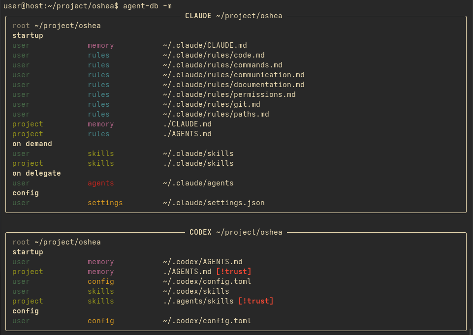

# agent-db

Build personal Claude Code and Codex configuration from one authoring tree.

`agent-db` reads reusable instructions, settings, skills, and agent definitions, then writes the files each tool expects in its own home directory. It is meant for personal config that should be repeatable without hand-editing multiple agent-specific files.

## Install

Installation requires Python 3.14 or newer and `uv`.

```bash
git clone git@github.com:brege/agent-db.git
cd agent-db
uv tool install -e .
```

## Run

```bash
agent-db
```

The default run writes changed files and prints only the paths it changed. A no-op run prints nothing.

Inspect what Claude or Codex will load from the current directory:

```bash
agent-db -m
agent-db -m -a claude
agent-db -m -a codex
```

`-m|--memory` prints the instruction files that the agents load from the current directory. `-a|--agent` limits the report to `claude`, `codex`, or `all`.

## Screenshot

[](docs/img/screenshot.png)

## Inputs

`agent-db` reads built-in defaults from `defaults/` and user config from `~/.config/agent-db` (on Linux).

Currently supported:

```text
instructions/*.md           adds to AGENTS.md or CLAUDE.md
settings.yaml               becomes settings.json or config.toml
settings/*.yaml             adds to settings.json or config.toml
skills/*/SKILL.md           adds to ~/.{claude,codex}/skills
agents/*                    adds to ~/.{claude,codex}/agents
```

## Outputs

Claude output goes to `~/.claude` unless `CLAUDE_CONFIG_DIR` is set:

```text
CLAUDE.md
output-styles/agent-db.md
settings.json
skills/*/SKILL.md
agents/*.md
```

Codex output goes to `~/.codex` unless `CODEX_HOME` is set:

```text
AGENTS.md
config.toml
rules/*.rules
skills/*/SKILL.md
agents/*.toml
```

`config.toml` is written only when authored Codex settings produce managed content or an existing managed block must change.

## Authoring

Markdown in `instructions/` becomes shared guidance for both tools. Files are merged by title key. A file can set frontmatter:

```yaml
---
title: Code
override: true
---
```

Settings live in `settings.yaml` or `settings/*.yaml`. `append` recursively merges mappings, extends lists, and replaces scalar or incompatible values. `override` replaces each named value wholesale.

## Project skill synchronization

A project can copy one skill source to multiple targets through `agent-db.toml`:

```toml
[skills]
source = "skills"
targets = [".claude/skills", ".agents/skills"]
```

Run synchronization from the project root:

```bash
agent-db sync
```

The command removes stale files only inside top-level skill directories present in the source. It does not remove unrelated sibling skills from a target.

## Security defaults

The distribution defines credential-path denials and enables Claude Code sandbox settings. See [docs/defaults.md](docs/defaults.md) for the denied locations, environment assumptions, and override behavior.

## References

Curated doc links live in [docs/reference/README.md](docs/reference/README.md). Generated reference snapshots under `docs/reference/claude/`, `docs/reference/codex/`, and `docs/reference/agents.md/` are ignored by git.

Refresh local snapshots with:

```bash
agent-db --refresh
```

## License

agent-db is distributed under the [GNU General Public License version 3](LICENSE).
