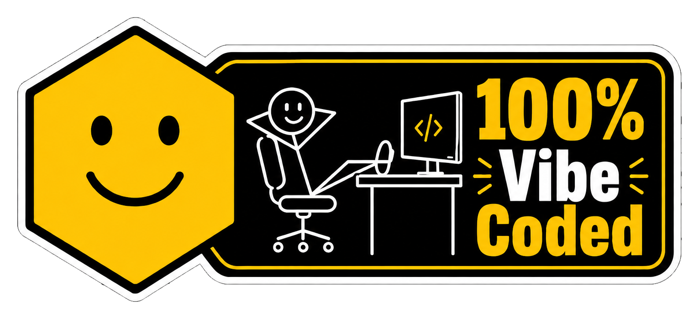

# agent-db

Build personal Claude Code and Codex configuration from one authoring tree.

## Install

```bash
uv tool install -e .
```

After package metadata or entry point changes:

```bash
uv tool install --force -e .
```

## Run

```bash
agent-db
```

`agent-db` prints changed files. A no-op run prints nothing.

Use another authoring tree for staging or migration:

```bash
agent-db --from prototype/new/user
```

## Inputs

User config:

```text
${AGENT_DB_HOME:-<platform config dir>/agent-db}
```

On Linux this is:

```text
~/.config/agent-db
```

Project defaults:

```text
defaults/
```

The source tree accepts:

```text
instructions/*.md
settings.yaml
settings/*.yaml
skills/*/SKILL.md
agents/*
```

## Outputs

Claude:

```text
${CLAUDE_CONFIG_DIR:-~/.claude}/CLAUDE.md
${CLAUDE_CONFIG_DIR:-~/.claude}/settings.json
${CLAUDE_CONFIG_DIR:-~/.claude}/rules/*.md
${CLAUDE_CONFIG_DIR:-~/.claude}/skills/*/SKILL.md
${CLAUDE_CONFIG_DIR:-~/.claude}/agents/*.md
```

Codex:

```text
${CODEX_HOME:-~/.codex}/AGENTS.md
${CODEX_HOME:-~/.codex}/config.toml
${CODEX_HOME:-~/.codex}/rules/*.rules
${CODEX_HOME:-~/.codex}/agents/*.toml
~/.agents/skills/*/SKILL.md
```

## References

Curated doc links live in [refs/README.md](refs/README.md). Generated reference snapshots under `refs/claude/`, `refs/codex/`, and `refs/agents.md/` are ignored by git.

Refresh local snapshots:

```bash
python docs.py
```

<a href="#readme"></a>
